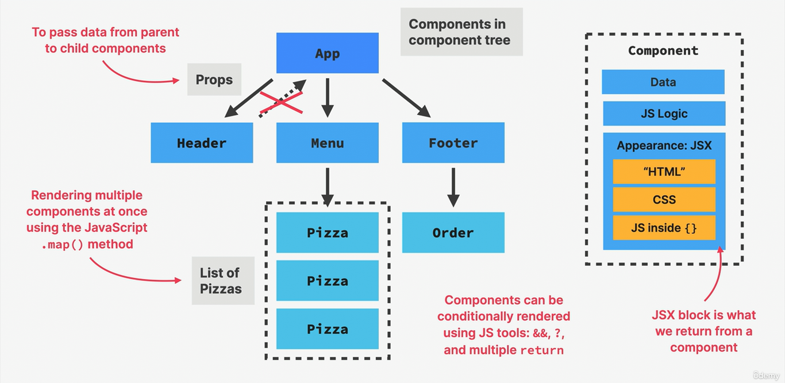

# Pizza Menu 🍕✨

Welcome to the **Pizza Menu** app! This is a React application that lets you explore a variety of delicious pizzas and their details. Perfect for pizza lovers and anyone looking to add a touch of flavor to their project portfolio!

## 📸 Screenshots

Here are some screenshots of the app:

- **Homepage**:

  

- **Project Summary**:

  

## 🚀 Features

- **Interactive Pizza Menu**: Browse through a variety of pizzas with detailed descriptions 🍕
- **Responsive Design**: Looks great on all devices 📱💻
- **Easy Navigation**: Find your favorite pizza quickly with intuitive navigation 🔍

## 🛠️ Getting Started

To get started with the Pizza Menu app, follow these steps:

1. **Clone the Repository**:

   ```bash
   git clone https://github.com/AnasHany2193/Pizza-Menu.git
   cd Pizza-Menu
   ```

2. **Install Dependencies**:

   ```bash
   npm install
   ```

3. **Start the Development Server**:

   ```bash
   npm start
   ```

   Your app will be running on `http://localhost:3000`.

## 📜 Project Structure

- **`src/`**: Contains all the React components and styling for the project.
- **`public/`**: Includes static files like images and the main HTML file.

## 💬 Contact

For any questions or suggestions, feel free to reach out:

- **LinkedIn**: [Anas Hany](https://www.linkedin.com/in/anashany219/)
- **GitHub**: [AnasHany2193](https://github.com/AnasHany2193)

Enjoy your pizza journey! 🍕🚀
